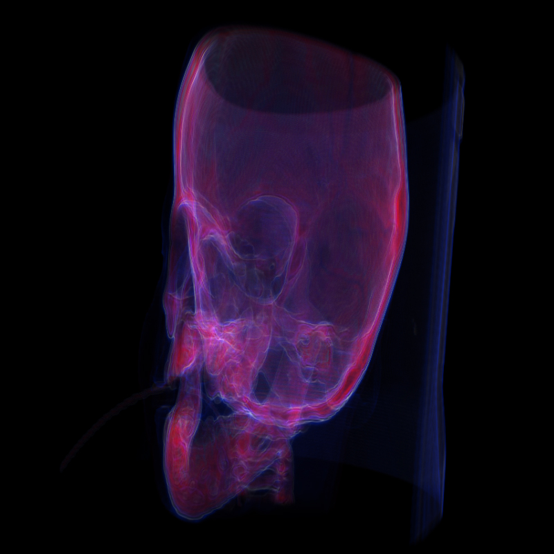
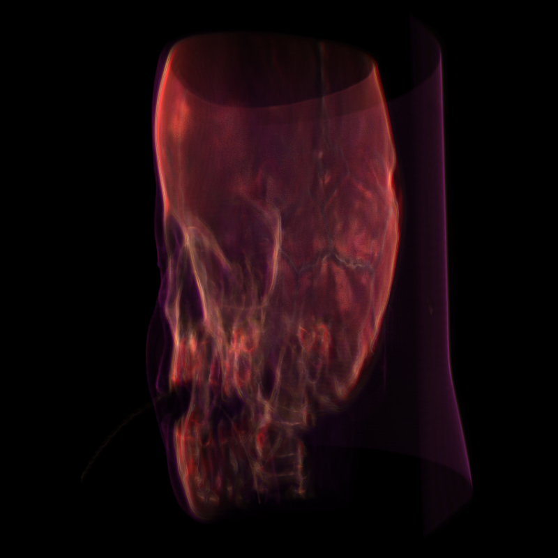

# Volumetric Ray Casting

Volumetric ray casting implementation in WebGL using [VPT](https://github.com/terier/vpt) framework.

## Renders

Video example: <https://youtu.be/KEstUN9zbAM>

## Features

* Random offset sampling
	* Shader generates noise based on random seed and fragment position to get a random offset for each ray
* Render accumulation
	* The average of all rendered frames is computed to achieve convergence
	* `AvgRender = AvgRender + (NewRender - AvgRender) / numRenders`
* Voxel gradient calculation
	* Sobel operator is used to detect edges within the volume and pre-compute gradients
	* Gradient magnitude is used for multiplying voxel opacity to make homogeneous regions invisible
	* Gradient direction is used for shading
* Transfer function
	* Map voxel densities and gradient magnitudes to RGB colors
* Light sources
	* Uniform (ambient) light
	* Point light
		* Attenuation: `1 / (1 + att * dist^2)`
	* Directional light
* Multiple simultaneous light sources
	* User can add and remove lights through the UI
* Reflection models (materials)
	* Lambertian
	* Phong
	* Blinn-Phong
